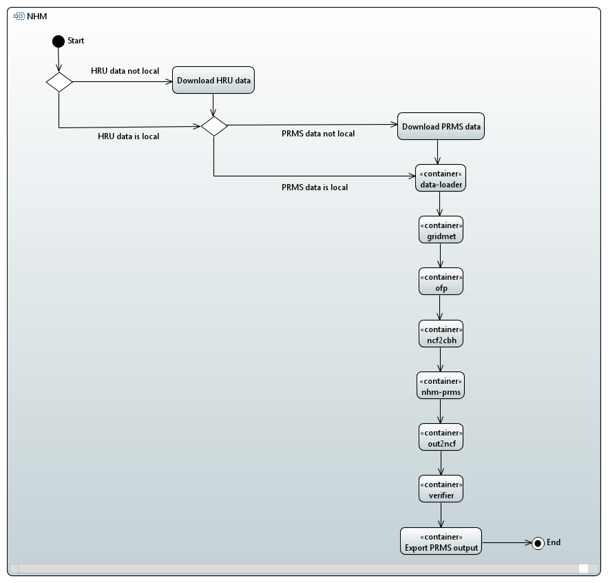

# USGS National Hydrologic Model (NHM), Docker Images

# UML Model
This directory contains a [Papyrus](https://www.eclipse.org/papyrus/) [UML](https://www.uml.org/) model of NHM to aid in developer discussions. If you are not interested in NHM development, this will probably not be useful.

## Activity Diagram
Apart from two conditionals that cache HRU and PRMS data on the local file-system, the system is almost entirely sequential:

